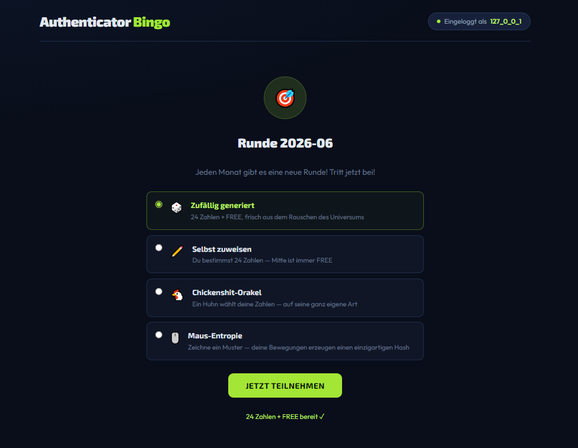
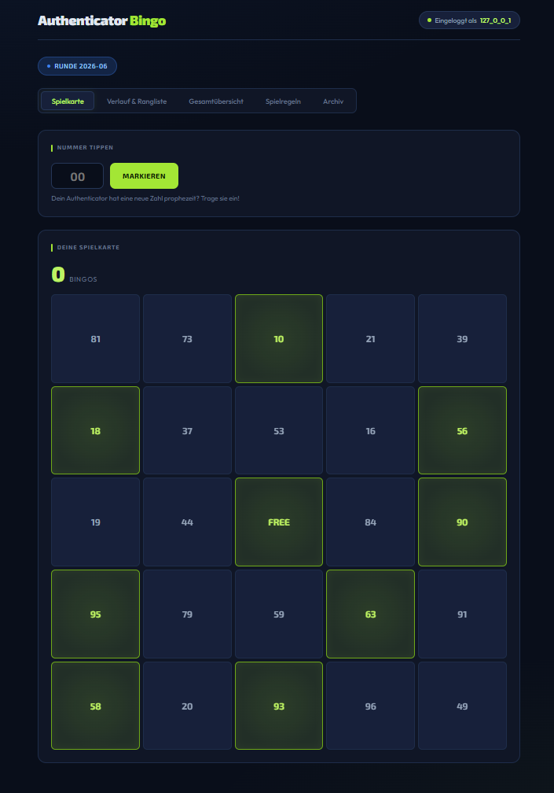
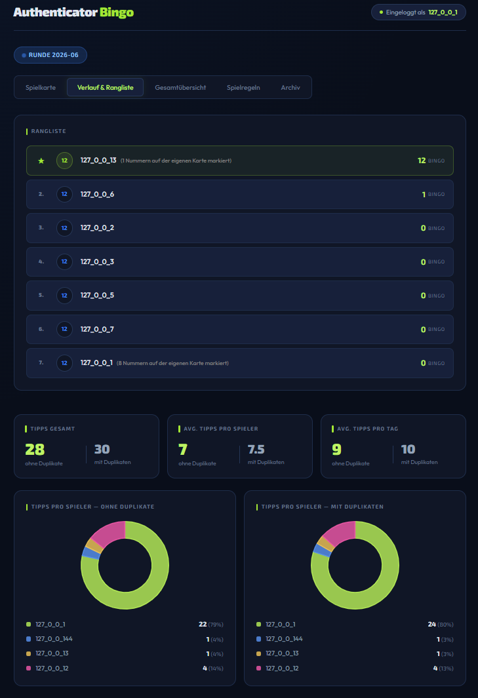
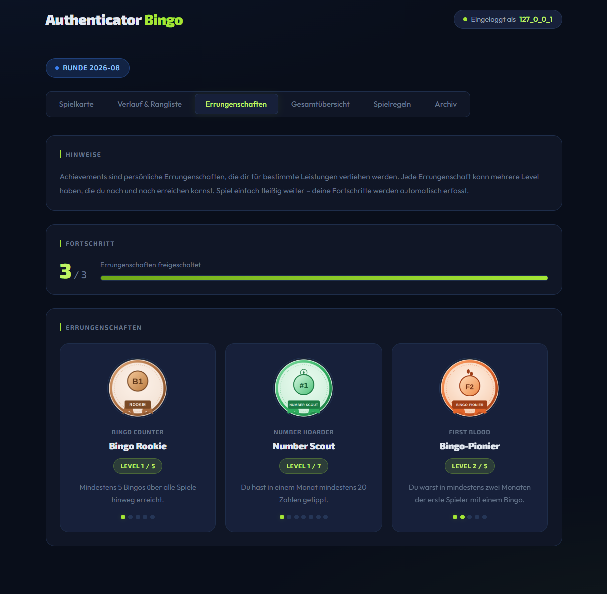

# Authenticator Bingo 🎯

A fun team game that turns your daily MFA routine into a bingo competition. Every time someone authenticates with Microsoft Authenticator (or any app that shows a two-digit push code), they submit the number — and everyone's bingo card gets marked automatically.

---

## How It Works

When you log in with an authenticator app, you're shown a two-digit number (10–99) to confirm the push notification. Instead of just tapping "Approve" and forgetting it, you enter that number into Authenticator Bingo. The number gets logged and marked on every player's card — whoever completes a row, column, or diagonal first scores a **BINGO**.

A new round starts every month with fresh cards.

---

## Screenshots






---

## Features

- **5×5 bingo cards** with numbers 10–99 and a FREE center square
- **Multiple card generation modes** — random cards, chicken-oracle cards, and mouse-entropy cards
- **Real-time shared state** — submitted numbers are marked for all players simultaneously
- **Monthly rounds** — each month is an independent game saved as a JSON file
- **Leaderboard & history** — track bingos per round and across all rounds
- **Archive** — browse all past months
- **Access control** — whitelist specific players via IP or Windows authentication
- **Exchange directory** — lightweight file-based mechanism for broadcasting new numbers to all clients

---

## Tech Stack

- **PHP** (no framework, no database)
- **JSON files** for game state persistence
- **Plain CSS + vanilla JS** for the frontend
- Runs on any standard web server (Apache, Nginx, etc.)

---

## Project Structure

```
AuthenticatorBingo/
├── index.php              # Entry point, routing, and game loop
├── src/
│   ├── config.php         # All configuration settings
│   ├── auth.php           # Player identification (IP or Windows auth)
│   ├── game.php           # Game class: card generation, marking, bingo detection
│   ├── achievements.php   # Achievement base class, loading, snapshots, and comparison
│   ├── achievements/      # Individual achievement implementations
│   │   ├── BingoCounter/  # Bingo count achievement and its images
│   │   ├── FirstBlood/    # First bingo achievement and its images
│   │   ├── Monatssieger/  # Monthly winner achievement and its images
│   │   └── NumberHoarder/ # Number count achievement and its images
│   └── stylesheet.css     # Application styles
├── pages/
│   ├── chooser.php        # Card selection screen for new players
│   ├── game.php           # Active bingo card view
│   ├── history.php        # Round history and leaderboard
│   ├── overall.php        # All-time overall standings
│   ├── archiv.php         # Archive of past rounds
│   ├── rules.php          # How to play
│   └── no-access.php      # Shown when ACL blocks a user
├── data/                  # Monthly game state (e.g. 2026-06.json)
├── exchange/              # Temporary files for broadcasting new numbers
└── favicon/               # App icons
```

---

## Setup

### Requirements

- PHP 8.0+
- A web server with PHP support (Apache, Nginx, IIS, or `php -S` for local use)
- Write permissions on the `data/` and `exchange/` directories (created automatically on first run)

### Installation

1. Clone or copy the project to your web server's document root (or a subdirectory).
2. Open `src/config.example.php` and adjust the settings for your environment (see below).
3. Rename `src/config.example.php` to `src/config.php`
4. Make sure the web server process can write to the project directory.
5. Open the app in your browser — the `data/` and `exchange/` directories are created automatically on the first visit. Create an config file for your webserver to protect them.

---

## Configuration

All settings live in `src/config.php`:

```php
#Title of application
$config["title"] = "Authenticator Bingo";
	
#Data dir
$config["data_dir"] = "data/";

#Send events to exchange dir
$config["send_events_to_exchange_dir"] = false;
$config["exchange_dir"] = "exchange/";

#Send events to a webhook trigger (POST) as json
$config["send_events_to_webhook"] = false;
$config["webhook_url"] = "your-webhook-url";

#Authentication mode
$config["auth_mode"] = "IP"; # IP | Windows

#ACL
$config["use_acl"] = false;
$config["acl_allowed_players"] = array(
	"127_0_0_1",
	"127_0_0_2",
	"127_0_0_3",
	"127_0_0_4",
	"127_0_0_5"
);
```

### Authentication Modes

| Mode | How players are identified |
|---|---|
| `IP` | Player's IP address (dots replaced with underscores, e.g. `192_168_1_10`) |
| `Windows` | Windows username from `REMOTE_USER` (e.g. via IIS Windows Authentication) |

### Access Control

Set `use_acl` to `true` and list the allowed player identifiers in `acl_allowed_players`. Anyone not on the list sees the no-access page. Set `use_acl` to `false` to allow anyone who can reach the server.

---

## Gameplay

1. **Join the round** — visit the app and register for the current month. You'll receive a 5×5 bingo card generated by one of the available methods.
2. **Submit numbers** — whenever your authenticator shows a two-digit push code, enter it into the app before anyone else does.
3. **Cards get marked** — once a number is submitted, it's automatically marked on every player's card where it appears.
4. **Score bingos** — complete a full row, column, or diagonal to score a BINGO. Multiple bingos per round are possible.
5. **Check the leaderboard** — the history tab shows who's submitted which numbers and the current bingo standings.

### Card generation modes

Players can choose from these card-generation methods when registering:

- **Random** — fully randomized 24-number card plus FREE center
- **Chickenshit-Orakel** — a playful chicken-based generator
- **Maus-Entropie** — mouse movements are turned into a hash-based card

The FREE square in the center (position [2][2]) is always marked.

## Achievements

Achievements are evaluated from the current game history for every registered player. The abstract `Achievement` class provides the shared context:

- `Achievement::$game_history` contains all loaded rounds and their `Game` objects.
- `Achievement::$user` is the player currently being evaluated.
- `update()` calculates the achievement's current progress value.
- `isAchieved()` determines whether the minimum requirement has been reached.
- `getElement()` returns the currently reached level as an array, or `null` if no level has been reached yet.
- `getNumberOfPossibleLevels()` returns the total number of levels.
- `getAchievementName()` returns the stable technical name used in snapshots and comparisons.

The application calls `getAchievementSnapshot()` before and after a number is marked. The snapshots are compared by player and achievement name. A newly present achievement triggers `new_achievement_unlocked`; a higher level triggers `next_achievement_level_reached`.

### Current achievements

#### Bingo Counter

Counts the total number of bingos a player has achieved across all available rounds.

| Level | Title | Requirement |
|---|---|---|
| 1 | Bingo Rookie | 5 total bingos |
| 2 | Bingo Veteran | 15 total bingos |
| 3 | Bingo Legend | 45 total bingos |
| 4 | Bingo Machine | 75 total bingos |
| 5 | Bingo God | 100 total bingos |

#### Number Hoarder

Counts how many numbers a player has submitted in a single month; the highest monthly total is used.

| Level | Title | Requirement |
|---|---|---|
| 1 | Number Scout | 20 numbers in one month |
| 2 | Number Hunter | 40 numbers in one month |
| 3 | Counter Commander | 60 numbers in one month |
| 4 | Number Ninja | 70 numbers in one month |
| 5 | Digit Dominator | 80 numbers in one month |
| 6 | Number Titan | 90 numbers in one month |
| 7 | Number Overlord | 150 numbers in one month |
#### Monatssieger

Counts how many completed monthly rounds a player has won. The current month is not counted until it has been completed.

| Level | Title | Requirement |
|---|---|---|
| 1 | Monatsrookie | Win 1 completed monthly round |
| 2 | Siegesanwärter | Win 2 completed monthly rounds |
| 3 | Bingo-Stratege | Win 3 completed monthly rounds |
| 4 | Doppelsieger | Win 4 completed monthly rounds |
| 5 | Bingo-Champion | Win 5 completed monthly rounds |
| 6 | Siegesmaschine | Win 6 completed monthly rounds |
| 7 | Bingo-Baron | Win 7 completed monthly rounds |
| 8 | Runden-Royalty | Win 8 completed monthly rounds |
| 9 | Bingo-Dynastie | Win 9 completed monthly rounds |
| 10 | Monatskaiser | Win 10 completed monthly rounds |

#### First Blood

Reconstructs every round from the card layouts and the chronological marking history, then counts the rounds in which the player was the first to complete a bingo.

| Level | Title | Requirement |
|---|---|---|
| 1 | Bingo-Erstschlag | First bingo in 1 round |
| 2 | Bingo-Pionier | First bingo in 2 rounds |
| 3 | Blitzstarter | First bingo in 3 rounds |
| 4 | Bingo-Überfall | First bingo in 4 rounds |
| 5 | First Blood Legende | First bingo in 5 rounds |

#### Multi Kill

Counts the highest number of bingos a player completed simultaneously with a single submitted number on their own card.

| Level | Title | Requirement |
|---|---|---|
| 1 | Double Kill | 2 bingos at once with the same number |
| 2 | Triple Kill | 3 bingos at once with the same number |
| 3 | Quadro Kill | 4 or more bingos at once with the same number |

#### Bingo-Zünder

Counts the highest number of new bingos triggered across all players by a single number submitted by the player.

| Level | Title | Requirement |
|---|---|---|
| 1 | Erster Funke | Trigger 1 bingo with a single number |
| 2 | Doppelzünder | Trigger 2 bingos with a single number |
| 3 | Kettenreaktion | Trigger 3 bingos with a single number |
| 4 | Vierfach-Treffer | Trigger 4 bingos with a single number |
| 5 | Kettensprenger | Trigger 5 bingos with a single number |
| 6 | Sechsfach-Knall | Trigger 6 bingos with a single number |
| 7 | Dominoeffekt | Trigger 7 bingos with a single number |
| 8 | Bingo-Lawine | Trigger 8 bingos with a single number |
| 9 | Sprengmeister | Trigger 9 bingos with a single number |
| 10 | Bingo-Detonator | Trigger 10 bingos with a single number |

### Adding an achievement

Use the complete example module in [`docs/achievements/ExampleAchievement/`](docs/achievements/ExampleAchievement/) as a template. It contains the PHP class, all required methods, the registration in `$available_achievements`, and two example PNG images.

To create your own achievement:

1. Copy the complete `docs/achievements/ExampleAchievement/` folder into `src/achievements/`.
2. Rename the copied folder, PHP file, and class to the name of your achievement. The folder name and class name must match, for example `src/achievements/Participation/Participation.php`.
3. Replace the example logic in `update()` with the calculation for your achievement. Use `self::$user` for the player currently being evaluated and `self::$game_history` for all available rounds.
4. Adjust the thresholds and level data in `getElement()`. Check levels from highest to lowest and return `null` if the achievement has not been reached.
5. Keep the registration line at the end of the module and update the class name if you renamed it:

```php
$available_achievements[] = new Participation();
```

#### Alternative: Create an achievement using an LLM

You can also use the following prompt. Simply replace `[INSERT THEME HERE]` with your own achievement idea and feed the complete prompt to your favorite LLM:

```text
Create an achievement module that I can simply import into this software project: https://github.com/eisenbahnhero/AuthenticatorBingo. The module should have multiple levels, each with a matching logo. Do not make any changes to the existing project; only provide the module folder, following the same structure as the other modules. Like the other modules, it should reconstruct achievements from the complete game history. The module must be error-free and importable without any additional changes. The theme should be: [INSERT THEME HERE].
```

The application automatically loads every PHP file one folder below `src/achievements/`; no additional `require_once` entry is needed in `src/achievements.php`.

Each non-null result from `getElement()` must be an associative array containing exactly these attributes:

- `title`: string displayed as the achievement title
- `description`: string explaining the achieved level
- `level`: integer containing the reached level
- `img`: image filename, relative to the module folder

The referenced image files must be stored in the same module folder as the PHP file. The `level` values must be consecutive and match `getNumberOfPossibleLevels()`. Keep `getAchievementName()` stable after deployment because the name identifies the achievement in event snapshots.

> **Got a cool new achievement idea?** New and creative achievement suggestions are very welcome! Submit your idea, or better direct the module, and it can be added to the project.

---

## Data Storage

Game state is stored as JSON files in the `data/` directory, one file per month (e.g. `data/2026-06.json`). No database is required.

The `exchange/` directory is used to propagate newly submitted numbers to all connected clients without requiring a database or WebSocket server. These files are small and temporary.

### Event Types

The app can emit events for important game actions. Each event includes at least a `type` and a `timestamp`, plus event-specific payload fields.

| Event type | Trigger |
|---|---|
| `new_player` | A player registers for the round. Payload contains the player identifier and the selected registration method (for example Random, Chickenshit, or Maus-Entropie). |
| `new_number_marked` | A number is submitted for the first time and gets marked on the shared game state. |
| `number_marked_again` | The same number is submitted again later, so it is treated as a duplicate/reauthorization event. |
| `new_bingo` | A player completes a new bingo as a result of a newly marked number. |
| `new_ultimate_bingo` | A player reaches 12 or more bingos after a newly marked number. |
| `new_achievement_unlocked` | A player reaches an achievement that was not present in the previous snapshot. Payload contains the player and achievement name. |
| `next_achievement_level_reached` | A player reaches a higher level of an existing achievement. Payload contains the player, achievement name, and new level. |

---

## License

This project is licensed under the MIT License – see the LICENSE file for details.